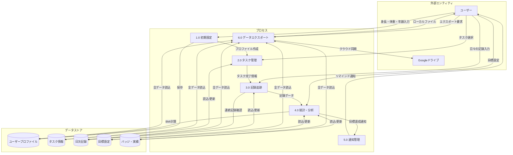

```mermaid
flowchart TD
    subgraph "外部エンティティ"
        User[ユーザー]
        GoogleDrive[Googleドライブ]
    end

    subgraph "プロセス"
        P1[1.0 初期設定]
        P2[2.0 タスク管理]
        P3[3.0 記録追跡]
        P4[4.0 統計・分析]
        P5[5.0 通知管理]
        P6[6.0 データエクスポート]
    end

    subgraph "データストア"
        D1[(ユーザープロファイル)]
        D2[(タスク情報)]
        D3[(日次記録)]
        D4[(目標設定)]
        D5[(バッジ・実績)]
    end

    %% ユーザーからのデータフロー
    User -->|身長・体重・年齢入力| P1
    User -->|タスク選択| P2
    User -->|日々の記録入力| P3
    User -->|目標設定| P4
    User -->|エクスポート要求| P6
    
    %% プロセス間のデータフロー
    P1 -->|プロファイル作成| P2
    P2 -->|タスク完了情報| P3
    P3 -->|記録データ| P4
    P4 -->|目標達成通知| P5
    
    %% データストアとの相互作用
    P1 -->|保存| D1
    P2 <-->|読込/更新| D2
    P3 <-->|読込/更新| D3
    P4 <-->|読込/更新| D4
    P4 <-->|読込/更新| D5
    
    %% 外部へのデータフロー
    P5 -->|リマインド通知| User
    P6 -->|ローカルファイル| User
    P6 -->|クラウド同期| GoogleDrive
    
    %% データの読み取り
    P3 -->|連続記録確認| D3
    P4 -->|BMI計算| D1
    P6 <-->|全データ読込| D1
    P6 <-->|全データ読込| D2
    P6 <-->|全データ読込| D3
    P6 <-->|全データ読込| D4
    P6 <-->|全データ読込| D5
```
aaaaaaa
